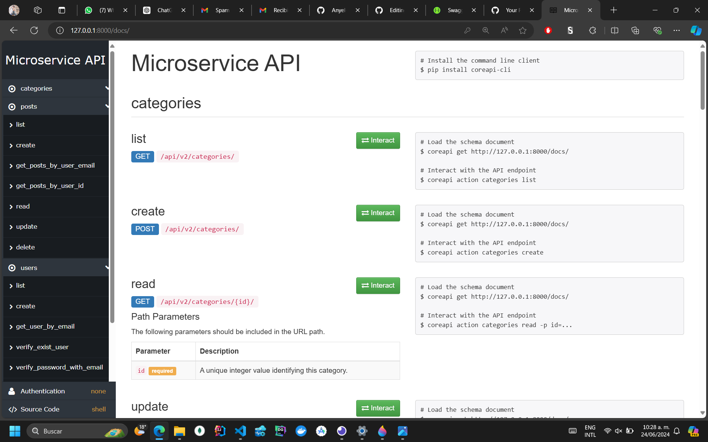
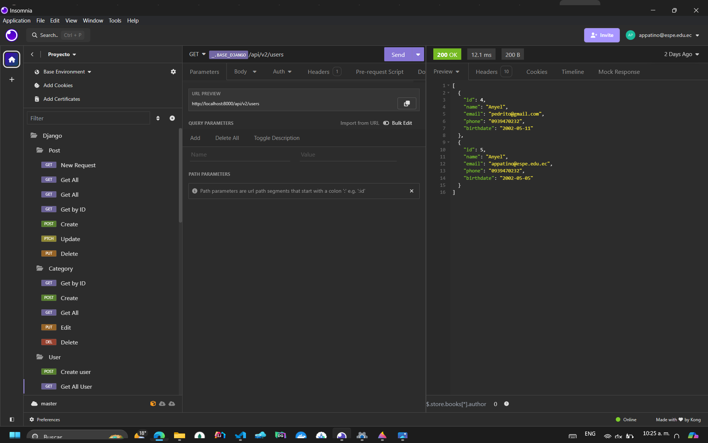

# **Select Language:** 🌍
- [Español (Spanish)](README-es.md)
- [English](README.md)

# Proyecto de Gestión de Usuarios, Posts y Categorías en Django

Este proyecto de Django es una aplicación para la gestión de usuarios, posts y categorías, utilizando el ORM propio de Django y una arquitectura de capas.

## RESULTS
## REST CONSUMER
### Core Documentation

### Test in Insomio (or Postman)



## Características

- **Usuarios**: Registro, actualización, eliminación y verificación de usuarios.
- **Posts**: Creación, actualización, eliminación y obtención de posts.
- **Categorías**: Creación, actualización, eliminación y obtención de categorías.

## Requisitos

- Python 3.8+
- Django 3.2+
- Django REST Framework

## Instalación

1. Clona el repositorio:
    ```sh
    git clone https://github.com/Anyel-ec/Django-REST-Py-SocialMedia-ORM
    cd Django-REST-Py-SocialMedia-ORM
    ```

2. Crea y activa un entorno virtual:
    ```sh
    python -m venv env
    source env/bin/activate  # En Windows usa `env\Scripts\activate`
    ```

3. Instala las dependencias:
    ```sh
    pip install -r requirements.txt
    ```

4. Realiza las migraciones de la base de datos:
    ```sh
    python manage.py migrate
    ```

5. Ejecuta el servidor de desarrollo:
    ```sh
    python manage.py runserver
    ```

## Arquitectura

El proyecto sigue una arquitectura de capas:

1. **Modelos**: Representan las entidades del dominio, como `User`, `Post` y `Category`.
2. **Repositorios**: Gestionan la comunicación con la base de datos.
3. **Servicios**: Contienen la lógica de negocio y las reglas de la aplicación.
4. **Vistas**: Gestionan las solicitudes HTTP y devuelven las respuestas apropiadas.

## Endpoints Principales

### Usuarios

- `POST /users/`: Crea un nuevo usuario.
- `GET /users/`: Obtiene la lista de todos los usuarios.
- `GET /users/{id}/`: Obtiene los detalles de un usuario específico.
- `PUT /users/{id}/`: Actualiza un usuario específico.
- `DELETE /users/{id}/`: Elimina un usuario específico.
- `POST /users/{id}/verify/`: Verifica la contraseña de un usuario.
- `POST /users/verify_login/`: Verifica las credenciales de inicio de sesión.

### Posts

- `POST /posts/`: Crea un nuevo post.
- `GET /posts/`: Obtiene la lista de todos los posts.
- `GET /posts/{id}/`: Obtiene los detalles de un post específico.
- `PUT /posts/{id}/`: Actualiza un post específico.
- `DELETE /posts/{id}/`: Elimina un post específico.
- `GET /posts/by_user/`: Obtiene los posts de un usuario específico.
- `GET /posts/by_email/`: Obtiene los posts de un usuario específico por su email.

### Categorías

- `POST /categories/`: Crea una nueva categoría.
- `GET /categories/`: Obtiene la lista de todas las categorías.
- `GET /categories/{id}/`: Obtiene los detalles de una categoría específica.
- `PUT /categories/{id}/`: Actualiza una categoría específica.
- `DELETE /categories/{id}/`: Elimina una categoría específica.

## Uso

Para probar la API, se recomienda utilizar herramientas como `Postman` o `curl` para realizar solicitudes HTTP a los endpoints mencionados anteriormente.

## Contribuciones

Las contribuciones son bienvenidas. Por favor, sigue estos pasos:

1. Haz un fork del repositorio.
2. Crea una nueva rama (`git checkout -b feature/nueva-feature`).
3. Realiza tus cambios y haz commit (`git commit -am 'Añade nueva feature'`).
4. Haz push a la rama (`git push origin feature/nueva-feature`).
5. Crea un nuevo Pull Request.

## Licencia

Este proyecto está bajo la Licencia MIT. Consulta el archivo `LICENSE` para más detalles.